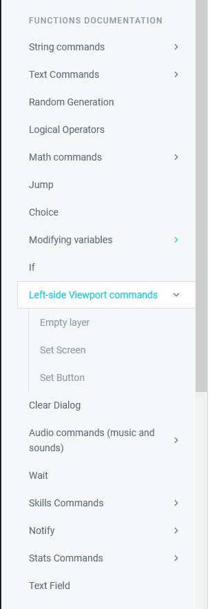
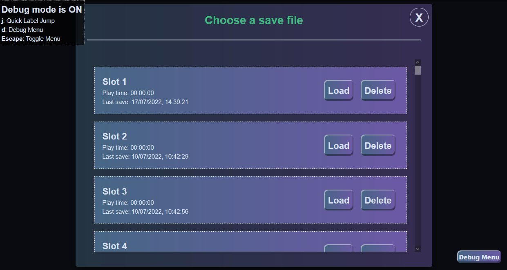
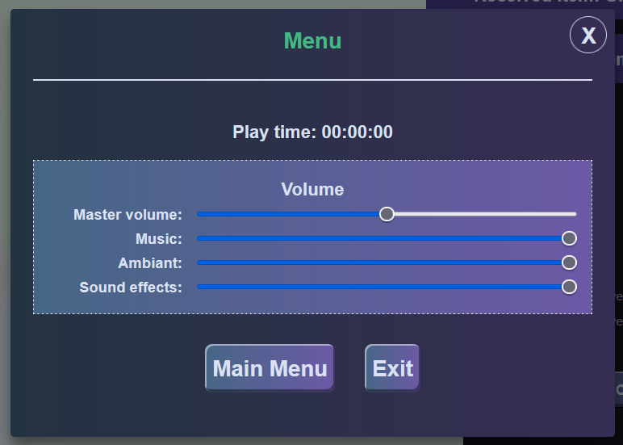

## Narrat 2.2.0

Narrat 2.2.0 (and a few more versions since) released recently, there are a few new features since the last 2.1.0 update:

### Docs rework

Documentation of the various commands has been reworked to be more exhaustive, and split in categories. There are a lot of commands now, and it was getting hard to find them in the docs, so this should be easier to follow.

### Steam Support

Narrat now has Steam support! The narrat template now provides by default everything needed to run on Steam.

`youtube: https://youtu.be/48TaPk1opDk`

See the [docs](https://docs.get-narrat.com/guides/publishing-on-steam-steamworks-integration) to learn how to publish for Steam

### Save slots

The engine now supports multiple save slots out of the box! There is no change required on the game side. The main menu will now show a "New Game" button, and if a game has already been started once, it will also show "Continue" (to continue the last save slots) or "Load Game" (to pick a save file)

### New volume mode, multiple audio channels per mode and individual volume sliders

There is a new audio mode: `ambiant` meant to be used for ambiant sounds. The engine has also been updated to support multiple audio channels per mode, and individual volume sliders for each channel.

What this means is that games can overlay multiple musics or ambiant sounds easily, and control each channel individually.

The menu modal with game options now shows one volume slider per audio mode, and a master volume slider for overall volume.

See the [audio commands](https://docs.get-narrat.com/functions-documentation/audio-commands-music-and-sounds) section of the docs for more info.

### New `think` command

A new [think](https://docs.get-narrat.com/functions-documentation/text-commands/talk-function-1) command has been added to narrat which works the same as the `talk` command but won't print quotes around the text.

The talk, think and text command now also use their own CSS class when displaying, so that it's easy for a game to customise how each version looks.

### New math commands

A lot of new math commands have been added to manipulate numbers, including functions to round numbers, make numbers positive/negative, constraining numbers between min and max values, and more.

Find them in the new [Math operations](https://docs.get-narrat.com/functions-documentation/math-commands/other-math-operations) docs

### Big internal Refactor

This doesn't really affect usage, but it fixes internal bugs and enables future development + better confidence in the codebase. To summarise, the way the Virtual Machine that runs narrat scripts works has been improved a lot.

More details: The scripting engine has been refactored internally to differentiate between blocks and frames. A frame in the stack is now a function call (running a label or jumping), whereas blocks are for branching. That means any block inside a frame still has access to the same scoped variables (which are stored in the frame), and `return` can now be called anywhere inside a function and will interrupt the function and return, like in other languages.

### And more stuff

See the full [changelog](https://github.com/liana-p/narrat/blob/main/CHANGELOG.md#228) of recent updates to find more new features
