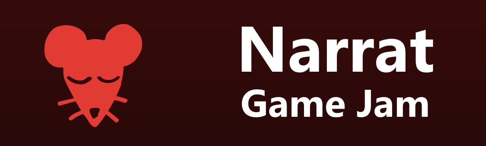

# Narrat Game Jam

There is a narrat game jam coming. This will be an occasion for anyone to try narrat out.

Anyone can join the game jam on the [itch.io page](https://itch.io/jam/narrat-game-jam)

The engine is very easy to get into as it has an easy scripting syntax and doesn't need much to get started.

A new tool to easily and automatically start a new project has been created for the occasion, see the updated [Getting Started](https://docs.get-narrat.com/guides/getting-started#creating-the-game-project) guide for info on how to start.

TLDR on how to create a narrat game with the new system:

1. Have node.js installed (16 or above)
2. Open a terminal and run `npm create narrat`
3. The tool will guide you and let you customise your game project. You're good to go!
