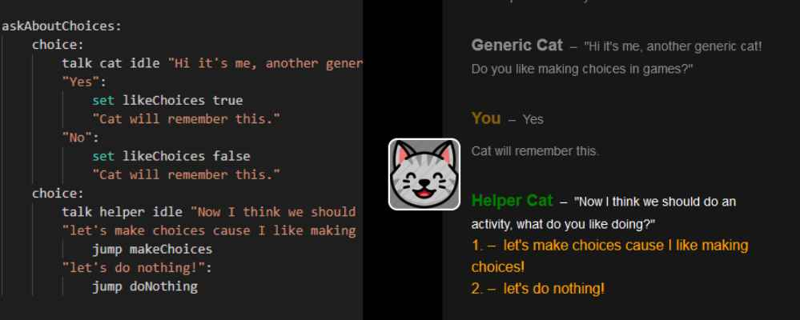

# Narrat

## What is narrat?

Narrat is a game engine for easily creative interactive narrative games with RPG elements. It can create games for the web and desktop.

This example shows the script of a game and the result on screen when playing.

There is an [online demo](https://get-narrat.com/demo/) available. It contains a built version of the [narrat game demo](https://github.com/nialna/narrat-demo)

## Getting Started


It's easy to get a narrat game running in a minute with the getting started guide



[getting-started.md](guides/getting-started.md)


### Example script and config


[example-narrat-script.md](examples/example-narrat-script.md)



[example-config.md](examples/example-config.md)



The sidebar on the left of this documentation has various sections worth looking at

* **Guides**: General guides on how to do things with the engine
* **Features**: Introduction to specific features and how to use them
* **Functions Documentation:** API Documentation for every command available to game scripts


### Features

* Easy script syntax for writing games without "real code"
* Branching, conditions and variables
* Multiple characters with configurable poses
* Themable UI (with CSS, explained in the docs)
* Skills and skill checks (dice rolls against skill levels) system
* Interactive visual screens alongside the dialogue
* HUD for currency or other stats
* save/load
* audio
* notifications
* Exports to web or PC
* Inventory
* Quests
* ... and more

## How it works

A narrat game is a web app built around Vue.js. It is composed of the following things:

* The [narrat template](https://github.com/nialna/narrat-template), which is a simple web app setup with narrat pre-installed and ready to use
* Some config files defining characters, assets and dialogue scripts
* Dialogue scripts, which are the actual content of your game

See the [Editing a narrat game](guides/customising-your-narrat-game.md) page for more info on how games work
