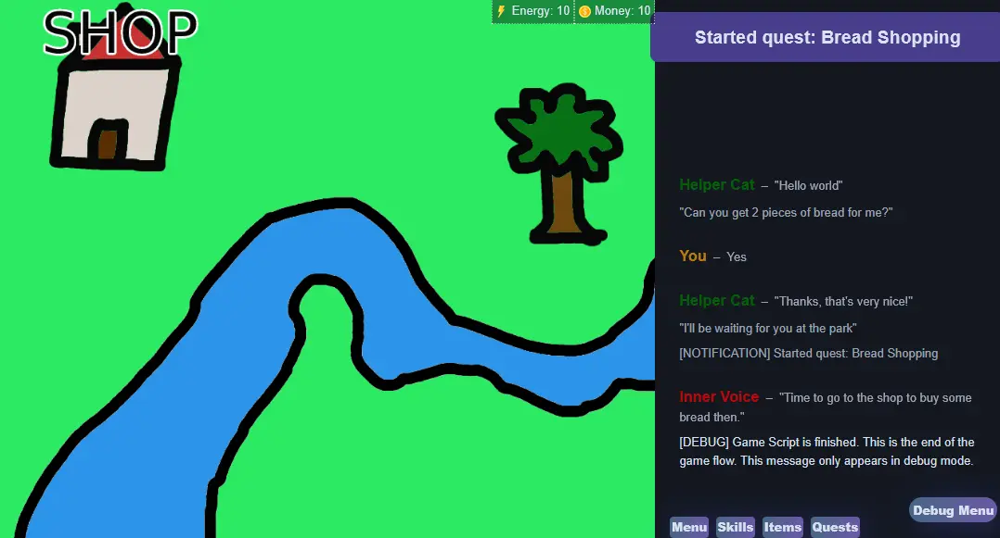

# Inventory

The inventory system allow players to collect and spend items. There is also a UI for viewing the inventory.


Possible items can be defined in the config:

```json
  "items": {
    "bread": {
      "name": "Bread",
      "description": "A bread in the game.",
      "icon": "img/items/bread.png"
    }
  }
```

Then items can be added/removed in scripts:

```renpy
main:
  add_item bread 15
  remove_item bread 10
  $if this.items.bread.amount > 0:
    talk helper idle "You have %{items.bread.amount} bread"
  else:
    talk helper idle "You have no bread"
```

 (1).png>)


