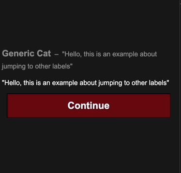

# Jump Function

## Jump Function

The `jump` function allows you to jump to a `label`. Labels are how you break down your scripts in reuseable and manageable chunks. You can jump from any file to a label in any other file.

## Example

Running this code will play the script inside `jump_example`, then run the script inside `label_to_jump`

```text
label_to_jump:
    talk cat idle "The code has now jumped to this label"

jump_example:
    talk cat idle "Hello, this is an example about jumping to other labels"
    talk cat idle "Use the jump command to jump to a different label in any of your scripts"
    jump label_to_jump
```




