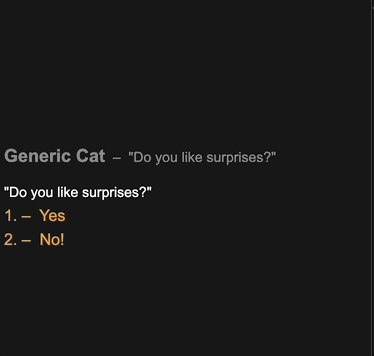

# If function

## if function

The `$if` command is the main method of doing conditions in narrat. It can be used to branch inside a script, or to make choice options conditionally available.

Syntax: `$if [condition]:`

If conditions have access to the following:

- `DATA`: The object containing the game variables created by functions like `set` and `add`
- `SKILLCHECKS`: The object containing the state of skill checks that have been passed


Note: The `$if` command is special and uses `eval` behind the scene to evaluate your condition as a piece of JavaScript that gets given access to specific variables


## Example

```text
set_example:
    choice:
        talk cat idle "Do you like surprises?"
        "Yes":
            set DATA.like_surprises true
        "No!":
            set DATA.like_surprises false
    $if this.DATA.like_surprises:
        talk cat idle "Since you like surprises, here's a surprise message"
```


